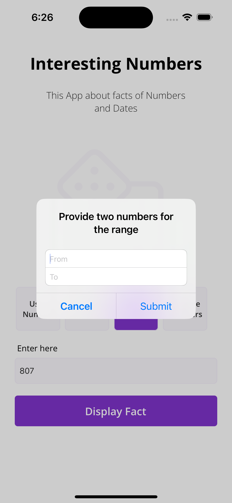

# Pixabay Free Images Search App
-----------------------------------------------------
<p float="left">
 
 
 
</p>
# Interesting Numbers App

This application provides interesting facts about numbers, utilizing the [InterestingNumbersLibrary](https://github.com/danmarchuk/InterestringNumbersLibrary) for data fetching.

## Features

- Display facts about the number entered by the user.
- Display facts about a random number.
- Display facts about a number in a range entered by the user.
- Display facts about multiple user-entered numbers.

## Requirements

- iOS 13 or later
- Swift 5

## Technologies Used

- UIKit for UI
- Auto Layout for layout
- MVC for architecture
- Figma for design
- Numbers API for data
- Swift Package Manager for dependency management

## Usage

### Getting Started

First, clone the repository and open the `.xcodeproj` or `.xcworkspace` file in Xcode. 

### Implementing the Library

The InterestingNumbersLibrary is utilized in the `FactsViewController`. It is initialized as:

```swift
var numbersManager = NumbersManager()
```

In the `viewDidLoad` method, the ViewController is set as the delegate of the `numbersManager`:

```swift
numbersManager.delegate = self
```

The `numbersManager` fetches facts according to the user's input:

```swift
numbersManager.fetchFacts(numbers: userInput)
```

The results are then processed and displayed in the collectionView.

## Contributing

Contributions are welcome! Please read the [contribution guidelines](CONTRIBUTING.md) first.

## License

This project is available under the MIT license.

## Notes

The library being used for data fetching, InterestingNumbersLibrary, is open-source and hosted on GitHub [here](https://github.com/danmarchuk/InterestringNumbersLibrary). It fetches data from the [Numbers API](http://numbersapi.com/), which may have rate limits. Please consult the Numbers API documentation for more details.

For the complete design of the app, refer to this [Figma link](https://www.figma.com/file/YSm9hPlxZtpMqPtHBpKkWq/Interesting-numbers).
